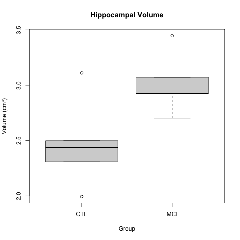

:::::::::::::::::::::::::::::::::::::: questions 

- What are some common reasons for irreproducibility?

::::::::::::::::::::::::::::::::::::::::::::::::

::::::::::::::::::::::::::::::::::::: objectives

- Describe a conceptual framework for reproducibility.
- Explain how and why adopting reproducible practices benefits research.

::::::::::::::::::::::::::::::::::::::::::::::::

## Problems in irreproducible research
From here we will look at some common problems in irreproducible research. We
will also discuss ways to overcome these problems. Recall that our definition of
reproducible research means that authors provide all data and code to run 
the analysis again, re-creating the results.

| *Methods*       | *Same Data*     | *Different Data* |
|---------------|:-------------:|------:|
| Same methods          | Reproducibility | Replicability |
| Different methods     | Robustness      | Generalizability |

We will also limit these examples to those that we can examine as analysts. The 
system of rewards and incentives is one that we must work within for the time
being, with an eye toward improving the culture of science. It is not something
that we can change in a day however. As analysts we also can't fix some of the 
human or technical issues that impact an experiment. We can investigate study 
design and statistics, however, in data analysis. We will focus on issues with
study design, misused methods, and batch effects.

| *Factors*                 | *Examples*                                       |
|---------------------------|--------------------------------------------------|
| Technical                 | Bad reagents or cell lines, natural variability  |
| Study design & statistics | Design flaws, misused methods, batch effects     |
| Human                     | Poor record keeping or sharing, confirmation bias|
| Rewards & incentives      | Fraud, paywalls, perverse incentives             |

::::::::::::::::::::::::::::::::::::: challenge 

## Case 1: The gene set that characterizes early Alzheimer's disease 

K.Q. Watkins and coauthors describe a unique gene set characteristic of early
onset Alzheimer's Disease. The gene expression heatmap from their paper
clearly delineates Alzheimer's patients from a neurotypical control group. 


Watkins, K. Q., et al. (2022). A unique gene expression signature characterizes 
early Alzheimer's disease. _Nature Alzheimer's_, 33(3), 737-753.

Use the [R script](./code/AD_heatmap.R), the [data](./data/expr_matrix.csv), and 
the [metadata](./data/expr_metadata.csv) to reproduce this plot. 

Can you find other ways to present the (meta)data in the heatmap? 
What do alternate ways of presenting the data show you?

This is a simulated study and publication. Any resemblance to real persons or 
real studies is purely coincidental.

:::::::::::::::  solution

## Solution to Case 1

1. You can replace `Diagnosis` with `Batch` in the call the `pheatmap`.

```r
pheatmap(expr_matrix, 
         annotation_col = metadata["Batch"], 
         fontsize_row   = 5)
```

This will show the same heatmap, though in this one the legend shows batch 
number instead of disease state. This is an example of complete confounding
between batch and diagnosis. All of the Alzheimer's samples were run in 
the first batch and all of the controls in the second. There is no way to
disentangle disease state from batch. 

The graphic below shows an example of complete confounding at right under
`Can't Be Corrected`. Batch 1 contains only controls and batch 2 only disease
samples. There is no method that will be able to discern the effect of the batch
from the effect of disease or control. 

Batch effects are common and can be corrected if samples are randomized to 
batch. At left beneath `Can Be Corrected`, control and disease samples were 
randomized to each of three batches. There can still be batch effects, however,
there are methods available (e.g. `ComBat`) that can correct for these effects.


:::::::::::::::::::::::::::::::::

::::::::::::::::::::::::::::::::::::::::::::::::

::::::::::::::::::::::::::::::::::::: challenge 

## Case 2: Hippocampal volume increase in mild cognitive impairment (MCI)

K.Z. Smith and coauthors describe higher mean hippocampal volume in subjects 
with mild cognitive impairment (MCI). The boxplots below show a clear difference 
in hippocampal volume between the MCI and control groups. 



Smith, K. Z., et al. (2023). Hippocampal volume increase in mild cognitive 
impairment. _Science Progress_, 3(14), 37-53.

A t-test gave a p-value of less than 0.05 to reject the null hypothesis of no 
difference in means between the two groups. The boxplots appear to back up this
assertion.

1. Use the [R script](./code/t_test.R) and the 
[data](./data/small_sample_data.csv) to reproduce the boxplot and t-test. 

2. Create a scatterplot of the data by group to get further insight. You can
also look at the entire dataset to get a sense of it.  

3. Calculate the effect size between the two groups.

```r
# Estimate effect size (Cohen's d for hippocampal volume)
library(effsize)
d_result <- cohen.d(HippocampalVolume ~ Group, data = hippocampus)
print(d_result)
```

4. Use the effect size to calculate statistical power. 

```r
# Estimate power for hippocampal volume
# Using observed effect size 
library(pwr)
power_result <- pwr.t.test(
  d = d_result$estimate,
  n = n_per_group,
  sig.level = 0.05,
  type = "two.sample",
  alternative = "two.sided"
)
print(power_result)
```

5. What sample size (`n_per_group`) would have resulted in 80% statistical power 
for this experiment?

This is a simulated study and publication. Any resemblance to real persons or 
real studies is purely coincidental.

:::::::::::::::  solution

## Solution to Case 2

1. 
```r
t_test_result <- t.test(HippocampalVolume ~ Group, data = hippocampus)
print(t_test_result)

boxplot(HippocampalVolume ~ Group, data = hippocampus, 
        main = "Hippocampal Volume", 
        ylab = "Volume (cm³)")
```

2. 
```r
hippocampus %>% ggplot(aes(Group, HippocampalVolume)) + geom_point()
```

3. 
```r
# Estimate effect size (Cohen's d for hippocampal volume)
library(effsize)
d_result <- cohen.d(HippocampalVolume ~ Group, data = hippocampus)
print(d_result)
```

```output
Cohen's d

d estimate: -1.558649 (large)
95 percent confidence interval:
     lower      upper 
-3.2238802  0.1065818
```

4. 
```r
# Estimate power for hippocampal volume
# Using observed effect size 
library(pwr)
power_result <- pwr.t.test(
  d = d_result$estimate,
  n = n_per_group,
  sig.level = 0.05,
  type = "two.sample",
  alternative = "two.sided"
)
print(power_result)
```

```output
     Two-sample t test power calculation 

              n = 5
              d = 1.558649
      sig.level = 0.05
          power = 0.581064
    alternative = two.sided

NOTE: n is number in *each* group
```

5.
```r
# Update sample size to 8
n_per_group <- 8

# Estimate power for hippocampal volume
# Using observed effect size 
power_result <- pwr.t.test(
  d = d_result$estimate,
  n = n_per_group,
  sig.level = 0.05,
  type = "two.sample",
  alternative = "two.sided"
)
print(power_result)
```

```output
     Two-sample t test power calculation 

              n = 8
              d = 1.558649
      sig.level = 0.05
          power = 0.8258431
    alternative = two.sided

NOTE: n is number in *each* group
```
:::::::::::::::::::::::::::::::::

::::::::::::::::::::::::::::::::::::::::::::::::

::::::::::::::::::::::::::::::::::::: challenge 

## Case 3: A novel biomarker for diagnosis of Alzheimer's Disease

Your colleague J Mackerel discovered a novel biomarker for Alzheimer's Disease
and provided you with [data](./data/multiple_testing_data.csv) and an 
[analysis script](./code/biomarkers.R) to review the finding. Run the script to 
load the data and reproduce the result. 

One of the biomarkers had a p-value of less than .05 in a t-test comparing means 
of the control and Alzheimer's groups. Your colleague is very excited and ready
to go to press with this!  

What do you recommend? How would you proceed? Are you convinced of the finding?

::::::::::::::::::::::::::::::::: solution
P-values are no longer useful to interpret when working with high-dimensional 
data because we are testing many *features* at the same time. This is called the
multiple comparison or multiple testing problem. When we test many hypotheses 
simultaneously, a list of p-values can result in many false positives. This 
example had relatively few features, however, enough t-tests were performed to
reasonably expect that a p-value less than .05 would occur.

The solution to the multiple testing problem is correction using a method such
as the Bonferroni correction.
:::::::::::::::::::::::::::::::::

::::::::::::::::::::::::::::::::::::::::::::::::


::::::::::::::::::::::::::::::::::::: keypoints 

- Reproducibility has many definitions.
- We define reproducibility here as using the same data and methods as the original study.
- Adopting reproducible practices strengthens science and makes it more rigorous.

::::::::::::::::::::::::::::::::::::::::::::::::
