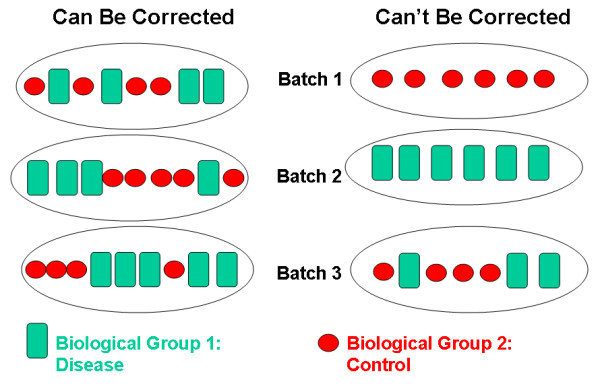
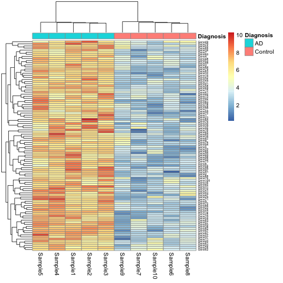
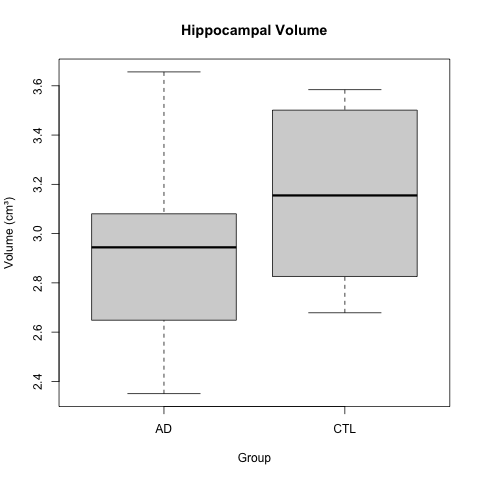

:::::::::::::::::::::::::::::::::::::: questions 

- What are some common reasons for irreproducibility?

::::::::::::::::::::::::::::::::::::::::::::::::

::::::::::::::::::::::::::::::::::::: objectives

- Describe a conceptual framework for reproducibility.
- Explain how and why adopting reproducible practices benefits research.

::::::::::::::::::::::::::::::::::::::::::::::::

## Solutions for irreproducible research
Solutions for irreproducible research already exist and are freely available. 
The open science movement encourages practices like data sharing and 
preregistration with an aim to make research freely available to everyone.
Adopting open science practices accelerates scientific progress and increases 
trust in research findings. Greater transparency and sharing improves research
reproducibility.

Reproducible research depends on understanding how experiments were performed 
and how data were generated. There are two critical elements to improve 
reproducibility:  
1. Increased transparency and sharing of research reagents, methods, and data  
2. Accelerated sharing of results (preprints)  
[from Reproducibility for Everyone](https://www.repro4everyone.org/)

Pre-registration is public sharing of your research and analysis plan prior to 
starting a study by submitting it to a registry like that hosted by the 
[Center for Open Science](https://www.cos.io/initiatives/prereg).
Pre-registering increases research transparency and rigor, which may boost
public confidence in federally funded research. Pre-registering can prevent 
overfitting, which happens when analysis decisions are too specific to a 
particular sample or study. Pre-registering also prevents some questionable 
research practices like p-hacking, cherry picking, or hypothesizing after 
results are known (HARKing). 

Data sharing starts by making a data sharing plan at the outset, before 
collecting any data. Data should be 
"*as open as possible and as closed as necessary*." The parts of the data to 
share should include:  
1. The raw data  
2. A tidy data set  
3. A data dictionary describing each variable and its values in the tidy data 
set   
4. An explicit and exact recipe you used to go from the raw data (1) to tidy 
data and the dictionary (2,3).  
adapted from [Ellis SE, Leek JT. 2017. How to share data for collaboration. PeerJ Preprints 5:e3139v5](https://doi.org/10.7287/peerj.preprints.3139v5)

Scripts to analyze the data can also be shared on platforms like Github. 
Reagents and methods can be shared in appropriate repositories.

|         | *Data Sets*| *Reagents*                    | *Scripts*          | *Methods*                    | *Paper*                      |
|---------|:-----------|:------------------------------|:------------------ |:-----------------------------|:-----------------------------|
| What    | Data sets  | New reagents, model organisms | Analysis scripts   | Detailed methods & protocols | Preprint ahead of publication|
| Where   | Repository | Repository                    | Developer platform | Repository                   | Preprint server              |
| Example | Dryad      | Addgene, Flybase              | Github             | protocols.io                 | AfricArXiv, BiorXiv, MedRxiv |

Accelerated sharing of research resources 
[from Reproducibility for Everyone](https://www.repro4everyone.org/)

## P-value interpretation
A p-value can indicate a statistically significant difference between study 
groups. It is not enough, though, to report only a p-value. The p-value says 
nothing about the effect size (the observed difference between groups). If the 
effect size was tiny, say .01 or less, would it matter how small the p-value is? 
The effect is negligible, so the p-value does nothing to demonstrate practical 
relevance or meaning. We should question how large the effect is. 

A p-value can only tell us whether an effect exists. However, a p-value greater 
than .05 doesn’t mean that no effect exists. The value .05 is rather arbitrary. 
Does a p-value of .06 mean that there is no effect? It does not. It would not 
provide evidence of an effect under standard statistical protocol. Absence of 
evidence is not evidence of absence. There could still be an effect.

P-values report statistical significance of an effect, but what we want is 
scientific significance. Confidence intervals include estimates of the effect 
size and uncertainty associated with these estimates. When reporting results, 
use confidence intervals.


A p-value is the probability of observing a statistic that extreme if the null 
hypothesis is true. 

The p-value is not
Probability the null is true
Probability the alternative is true
A measure of statistical evidence

Suppose 550 out of 10,000 genes are significant at 0.05 level

P-value < 0.05
Expect 0.05*10,000 = 500 false positives
- Jeff Leek

## Batch effects
no randomization
with randomization still batch effects due to technician, time of day, weather,
or any other variable not under study that influence the study nevertheless.
Randomization balances out these other variables


## Small sample size and low power
Small sample size is often cost per sample
statistical power is the power to detect a real effect if it exists

Review the following figure to explore the relationships between effect size, 
sample size, and power. What is the relationship between effect size and sample 
size? Between sample size and power?

```{r power-curve-2, echo=FALSE}
library(broom)
library(tidyverse)

# start with a vector of effect size values to plot
seq(.01, 2, .49) %>% 
  # reverse the vector so the legend labels 
  # and the curves are in the same vertical order 
  rev() %>% 
  # map will help us perform power calculations for every
  # value in the vector of effect sizes
  map(
    # the purrr function will first do the power calculations, 
    # then turn it into a data frame,
    # then make a column that records the effect size 
    ~ power.t.test(
      # small steps in n values make a smooth plot
      n = seq(2, 100, .05), 
      # .x is each value in the effect size vector
      delta = .x) %>% 
      # turn the power.htest object into a dataframe (tibble)
      tidy() %>% 
      # keep track of the effect size 
      # for this set of calculations
      mutate(effect_size=as.factor(.x)) 
  ) %>%
  # map will return a list of data frames of the power
  # calculations so we need to turn it into a single dataframe
  bind_rows() %>% 
  # now we have data we can plot as usual!
  ggplot(aes(n, power, color=effect_size)) +
  # we used a lot of points so this geom_line will look smooth
  geom_line() +
  labs(y="Power",
       x = "Sample size",
       color = "Effect Size (Cohen's d)") +
  theme_bw()
```

Code adapted from 
[How to Create Power Curves in ggplot](https://levibaguley.github.io/2020/06/22/how-to-create-power-curves-in-ggplot/) 
by Levi Baguley

Notice that to detect a standardized effect size of 0.5 at 80% power, you would 
need a sample size of approximately 70. Larger effect sizes require much smaller
sample sizes. Very small effects such as .01 never reach the 80% power threshold
without enormous samples sizes in the hundreds of thousands.

::::::::::::::::::::::::::::::::::::: challenge 

## Case 1: The gene set that characterizes early Alzheimer's disease 

K.Q. Watkins and coauthors describe a unique gene set characteristic of early
onset Alzheimer's Disease. The gene expression heatmap from their paper
clearly delineates Alzheimer's patients from a neurotypical control group. 



Watkins, K. Q., et al. (2022). A unique gene expression signature characterizes 
early Alzheimer's disease. _Nature Alzheimer's_, 33(3), 737-753.

Use the [R script](./code/AD_heatmap.R), the [data](./data/expr_matrix.csv), and 
the [metadata](./data/expr_metadata.csv) to reproduce this plot. 

Can you find other ways to present the (meta)data in the heatmap? 
What do alternate ways of presenting the data show you?

This is a simulated study and publication. Any resemblance to real persons or 
real studies is purely coincidental.

:::::::::::::::  solution

## Solution to Case 1

1. You can replace `Diagnosis` with `Batch` in the call the `pheatmap`.

```r
pheatmap(expr_matrix, 
         annotation_col = metadata["Batch"], 
         fontsize_row   = 5)
```

This will show the same heatmap, though in this one the legend shows batch 
number instead of disease state. This is an example of complete confounding
between batch and diagnosis. All of the Alzheimer's samples were run in 
the first batch and all of the controls in the second. There is no way to
disentangle disease state from batch. 

The graphic below shows an example of complete confounding at right under
`Can't Be Corrected`. Batch 1 contains only controls and batch 2 only disease
samples. There is no method that will be able to discern the effect of the batch
from the effect of disease or control. 

Batch effects are common and can be corrected if samples are randomized to 
batch. At left beneath `Can Be Corrected`, control and disease samples were 
randomized to each of three batches. There can still be batch effects, however,
there are methods available (e.g. `ComBat`) that can correct for these effects.


:::::::::::::::::::::::::::::::::

::::::::::::::::::::::::::::::::::::::::::::::::

::::::::::::::::::::::::::::::::::::: challenge 

## Case 2: Hippocampal volume increase in mild cognitive impairment (MCI)

K.Z. Smith and coauthors describe increased hippocampal volume in subjects with 
mild cognitive impairment (MCI). The boxplots below show a clear difference in
hippocampal volume between the MCI and control groups. 



Smith, K. Z., et al. (2023). Hippocampal volume loss in mild cognitive 
impairment. _Science Progress_, 3(14), 37-53.

A t-test gave a p-value of less than 0.05 to reject the null hypothesis of no 
difference in means between the two groups. The boxplots appear to back up this
assertion.

1. Use the [R script](./code/t_test.R) and the 
[data](./data/small_sample_data.csv) to reproduce the boxplot and t-test. 

2. Create a scatterplot of the data by group to get further insight. You can
also look at the entire dataset to get a sense of it.  

3. Calculate the effect size between the two groups.

```r
# Estimate effect size (Cohen's d for hippocampal volume)
library(effsize)
d_result <- cohen.d(HippocampalVolume ~ Group, data = data)
print(d_result)
```

4. Use the effect size to calculate statistical power. 

```r
# Estimate power for hippocampal volume
# Using observed effect size 
library(pwr)
power_result <- pwr.t.test(
  d = d_result$estimate,
  n = n_per_group,
  sig.level = 0.05,
  type = "two.sample",
  alternative = "two.sided"
)
print(power_result)
```

5. What sample size (`n_per_group`) would have resulted in 80% statistical power 
for this experiment?

This is a simulated study and publication. Any resemblance to real persons or 
real studies is purely coincidental.

:::::::::::::::  solution

## Solution to Case 2

1. 
```r
t_test_result <- t.test(HippocampalVolume ~ Group, data = data)
print(t_test_result)

boxplot(HippocampalVolume ~ Group, data = data, main = "Hippocampal Volume", 
        ylab = "Volume (cm³)")
```

2. 
```r
data %>% ggplot(aes(Group, HippocampalVolume)) + geom_point()
```

3. 
```r
# Estimate effect size (Cohen's d for hippocampal volume)
library(effsize)
d_result <- cohen.d(HippocampalVolume ~ Group, data = data)
print(d_result)
```

```output
Cohen's d

d estimate: -1.558649 (large)
95 percent confidence interval:
     lower      upper 
-3.2238802  0.1065818
```

4. 
```r
# Estimate power for hippocampal volume
# Using observed effect size 
library(pwr)
power_result <- pwr.t.test(
  d = d_result$estimate,
  n = n_per_group,
  sig.level = 0.05,
  type = "two.sample",
  alternative = "two.sided"
)
print(power_result)
```

```output
     Two-sample t test power calculation 

              n = 5
              d = 1.558649
      sig.level = 0.05
          power = 0.581064
    alternative = two.sided

NOTE: n is number in *each* group
```

5.
```r
# Update sample size to 8
n_per_group <- 8

# Estimate power for hippocampal volume
# Using observed effect size 
power_result <- pwr.t.test(
  d = d_result$estimate,
  n = n_per_group,
  sig.level = 0.05,
  type = "two.sample",
  alternative = "two.sided"
)
print(power_result)
```

```output
     Two-sample t test power calculation 

              n = 8
              d = 1.558649
      sig.level = 0.05
          power = 0.8258431
    alternative = two.sided

NOTE: n is number in *each* group
```
:::::::::::::::::::::::::::::::::

::::::::::::::::::::::::::::::::::::::::::::::::

::::::::::::::::::::::::::::::::::::: challenge 

Case 3: 

::::::::::::::::::::::::::::::::: solution
:::::::::::::::::::::::::::::::::

::::::::::::::::::::::::::::::::::::::::::::::::


::::::::::::::::::::::::::::::::::::: keypoints 

- Reproducibility has many definitions.
- We define reproducibility here as using the same data and methods as the original study.
- Adopting reproducible practices strengthens science and makes it more rigorous.

::::::::::::::::::::::::::::::::::::::::::::::::