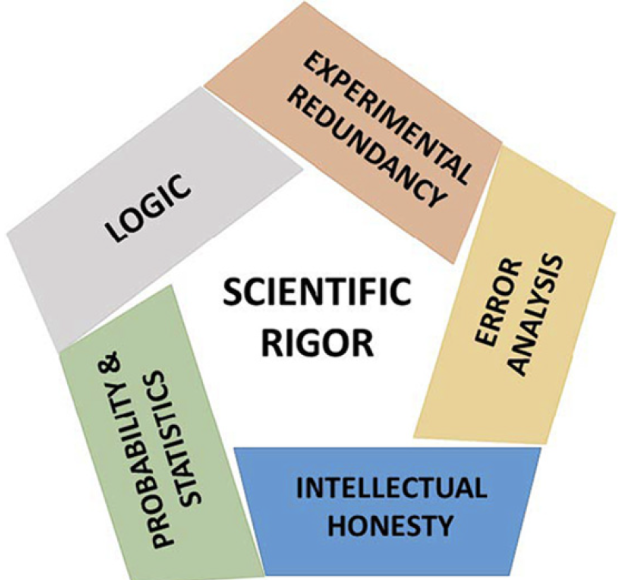

:::::::::::::::::::::::::::::::::::::: questions 

- What is reproducibility?

::::::::::::::::::::::::::::::::::::::::::::::::

::::::::::::::::::::::::::::::::::::: objectives

- Describe a conceptual framework for reproducibility.
- Explain how and why adopting reproducible practices benefits research.

::::::::::::::::::::::::::::::::::::::::::::::::

## Introduction

What does reproducibility mean? This is not and easy question to answer because 
it has different definitions depending on the discipline. To start we need to 
state our definition so that we can all be on the same page.

Reproducibility is distinct from replicability, although the two are often used
interchangeably ([Barba, 2018](https://arxiv.org/abs/1802.03311), 
[Schloss, 2018](10.1128/mBio.00525-18)).

*Reproducible research*: Authors provide all the necessary data and code to run 
the analysis again, re-creating the results.

*Replication*: A study that arrives at the same scientific findings as another 
study, collecting new data and completing new analyses.

Replication requires reproducibility but has a higher goal to re-run an entire 
study rather than only re-create original results using the same data and code. 
In replication you're running a whole new study, obtaining new data, and running 
a new analysis. 

| *Methods*       | *Same Data*     | *Different Data* |
|---------------|:-------------:|------:|
| Same methods          | Reproducibility | Replicability |
| Different methods     | Robustness      | Generalizability |

This table is adapted from [The Turing Way](https://the-turing-way.netlify.app/).
When you use the same methods and the same data as the original study and get 
the same results, that is reproducibility. If you get the same results using the 
same data but different methods, such as using a different statistical approach, 
that is robustness. That means the study’s findings are robust to changes in the 
methods. If you are gathering new data and rerunning another study with the same 
methods and get the same findings, that study is replicable. Finally, what we 
all are hoping to be able to achieve is to be able to not only replicate a study 
and get the same results, but to have those results replicate to different 
populations or different analysis methods. That is the gold standard of 
reproducibility and means you are making a big contribution to research.
([Reproducibility for Everyone](https://www.repro4everyone.org/),
[Schloss, 2018](10.1128/mBio.00525-18))

## Reproducibility is not all that matters
Reproducibility is only one aspect we need to try to improve in science. There
are several others as well that influence scientific rigor. We should aim to do 
a little better every time we carry out a study and be aware of these other
aspects of rigorous science.

{alt='A pentagram showing five elements of scientific rigor - logic, experimental redundancy, error analysis, intellectual honesty, and probability and statistics.'}

## Factors that decrease reproducibility
There are many factors that decrease reproducibility: technical, human, 
study design and statistics, and problems with rewards and incentives. It's 
complex in that issues with reproducibility arise out of many smaller decisions 
and environments that we encounter in research.

| *Factors*                | *Examples*                                     |
|--------------------------|:-------------------------------------------------:|
| Technical                | Bad reagents or cell lines, natural variability   |
| Study design & statistics| Design flaws, misused methods, batch effects      |
| Human                    | Poor record keeping or sharing, confirmation bias |
| Rewards & incentives     | Fraud, paywalls, perverse incentives              |

Other examples, like mistakes and lack of training, encompass all of these 
factors - technical, study design, statistical, human, and rewards and 
incentives. It's best to think of this this as an opportunity for us to do 
better, as a community and as as individuals over time, rather than being 
overwhelmed by what has been described as a reproducibility crisis. We need to 
learn a little bit about how to do science better with the new methods, 
information, and understanding that we gain. Think about reproducibility as an 
incremental process. Every time you start a new project, you can make one change 
to make it a little bit more reproducible, to make it a little bit more 
transparent. Then you’re on the right path towards improving and accelerating 
your work. So better methods, more data, more power. Larger studies, less 
pressure to publish, fewer incentives to be first rather than right, sharing 
reagents and code, and sharing all of your information about your statistical 
packages.
([Reproducibility for Everyone](https://www.repro4everyone.org/))

We need more incentives to actually reproduce each other's work, and for labs to 
reproduce each other's work. In this lesson we will stay with the simple case
of results reproducibility - using the same data and code to generate the same
results (or not!). This gives us the opportunity to look at some of issues that
prevent even the simplest case of results reproducibility, so that we might
adopt some new practices or change our existing ones a bit.


::::::::::::::::::::::::::::::::::::: challenge 

## Challenge 1: Can you do it?

What is the output of this command?

```r
paste("This", "new", "lesson", "looks", "good")
```

:::::::::::::::::::::::: solution 

## Output
 
```output
[1] "This new lesson looks good"
```

:::::::::::::::::::::::::::::::::


## Challenge 2: how do you nest solutions within challenge blocks?

:::::::::::::::::::::::: solution 

You can add a line with at least three colons and a `solution` tag.

:::::::::::::::::::::::::::::::::
::::::::::::::::::::::::::::::::::::::::::::::::


::::::::::::::::::::::::::::::::::::: callout

Callout sections can highlight information.

They are sometimes used to emphasise particularly important points
but are also used in some lessons to present "asides": 
content that is not central to the narrative of the lesson,
e.g. by providing the answer to a commonly-asked question.

::::::::::::::::::::::::::::::::::::::::::::::::


::::::::::::::::::::::::::::::::::::: keypoints 

- Use `.md` files for episodes when you want static content
- Use `.Rmd` files for episodes when you need to generate output
- Run `sandpaper::check_lesson()` to identify any issues with your lesson
- Run `sandpaper::build_lesson()` to preview your lesson locally

::::::::::::::::::::::::::::::::::::::::::::::::

